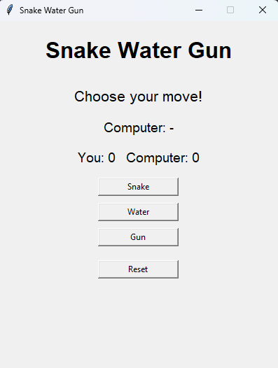
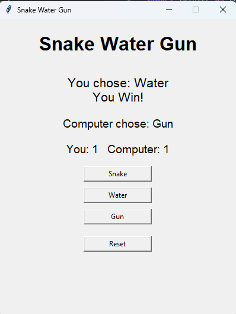
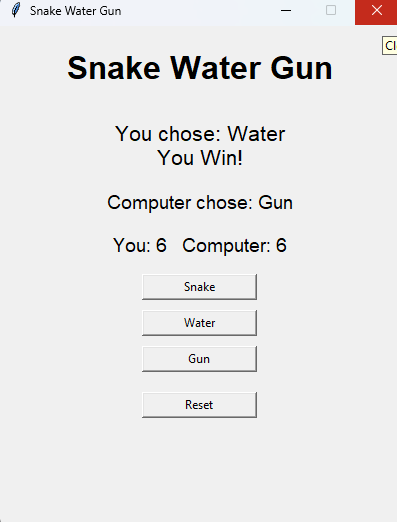

# 🐍 Snake Water Gun

A simple and interactive **Snake Water Gun** game built using **Python**
and the **Tkinter** GUI library. The project is organized into multiple
Python files to separate the game logic, GUI, constants, and utility
functions.

------------------------------------------------------------------------

## 📖 Overview

**Snake Water Gun** is a variation of the classic Rock Paper Scissors
game. The player chooses one of three options:

-   🐍 **Snake**
-   💧 **Water**
-   🔫 **Gun**

The computer randomly selects one of the three options, and the winner
is determined using the following rules:

  Player        Computer      Result
  ------------- ------------- -------------
  Snake         Water         Player Wins
  Water         Gun           Player Wins
  Gun           Snake         Player Wins
  Same choice   Same choice   Draw

If none of the winning combinations match, the computer wins.

The project demonstrates Python functions, modules, random choice
generation, dictionaries, conditional statements, and GUI development
using **Tkinter**.

------------------------------------------------------------------------

## ✨ Features

-   🎮 Interactive graphical user interface
-   🐍 Snake, Water, and Gun buttons
-   🤖 Computer makes a random choice
-   🏆 Automatically determines the winner
-   📊 Displays the result of each round
-   🔢 Tracks the player and computer scores
-   🤝 Handles draw/tie situations
-   🔄 Reset button to start a new game
-   🧩 Modular code separated into multiple Python files
-   💻 Simple and beginner-friendly interface
-   ⚡ Lightweight and runs locally
-   🖥️ Uses Python's built-in Tkinter library

------------------------------------------------------------------------

## 🛠️ Technologies / Tools Used

-   **Python 3**
-   **Tkinter** -- Used to create the graphical user interface
-   **Random module** -- Used to randomly select the computer's move
-   **Git & GitHub** -- For version control and project hosting

------------------------------------------------------------------------

## 📁 Project Structure

``` text
ProjectS/
│
├── main.py              # Starts the application and creates the main window
├── gui.py               # Creates the GUI and handles user interaction
├── game_logic.py        # Handles computer choices and determines the result
├── constants.py         # Stores game choices and winning combinations
├── utils.py             # Handles score updates and score reset
└── README.md            # Project documentation
```

### File Responsibilities

  -----------------------------------------------------------------------
  File                         Purpose
  ---------------------------- ------------------------------------------
  `main.py`                    Creates the Tkinter window, sets its
                               properties, starts the GUI, and runs the
                               main loop.

  `gui.py`                     Builds the interface, handles button
                               clicks, displays results, and updates the
                               score.

  `game_logic.py`              Generates the computer's choice and
                               determines whether the round is a win,
                               loss, or draw.

  `constants.py`               Defines `SNAKE`, `WATER`, `GUN`, the
                               available choices, and the winning
                               combinations.

  `utils.py`                   Contains functions for updating and
                               resetting the score.
  -----------------------------------------------------------------------

> **Note:** Python may automatically create a `__pycache__` folder
> containing `.pyc` files when the project is run. These are generated
> cache files and are not required to run the project.

------------------------------------------------------------------------

## ⚙️ Installation & Setup

### 1. Install Python

Make sure **Python 3** is installed on your computer.

Check your Python version using:

``` bash
python --version
```

If that command does not work, try:

``` bash
python3 --version
```

------------------------------------------------------------------------

### 2. Clone the Repository

Clone the project from GitHub:

``` bash
git clone <YOUR-GITHUB-REPOSITORY-URL>
```

Move into the project directory:

``` bash
cd ProjectS
```

> Replace `<YOUR-GITHUB-REPOSITORY-URL>` with the actual URL of your
> GitHub repository.

------------------------------------------------------------------------

### 3. Check Tkinter

Tkinter is included with most standard Python installations.

You can check whether Tkinter is available by running:

``` bash
python -m tkinter
```

If Tkinter is installed correctly, a small test window should appear.

------------------------------------------------------------------------

## ▶️ Running the Project

From inside the `ProjectS` directory, run:

``` bash
python main.py
```

If your system uses `python3`, run:

``` bash
python3 main.py
```

The **Snake Water Gun** game window should open.

------------------------------------------------------------------------

## 🎮 How to Play

1.  Launch the application.
2.  Click **Snake**, **Water**, or **Gun**.
3.  The computer randomly selects its move.
4.  The game displays both choices.
5.  The result of the round is displayed.
6.  The score is updated automatically.
7.  Continue playing as many rounds as you want.
8.  Click **Reset** to reset both scores and start a new game.

------------------------------------------------------------------------

## 📜 Game Rules

The game uses these winning combinations:

``` text
Snake  beats Water
Water  beats Gun
Gun    beats Snake
Same   results in Draw
```

The rules are also defined programmatically in `constants.py` using:

``` python
WINNING_COMBINATIONS = {
    (SNAKE, WATER),
    (WATER, GUN),
    (GUN, SNAKE)
}
```

------------------------------------------------------------------------

## 🧪 Testing Instructions

Test the application using the following cases.

### Test 1 --- Player Wins

Select a move that beats the computer's move.

Expected result:

``` text
You Win!
```

### Test 2 --- Computer Wins

Select a move that loses to the computer's move.

Expected result:

``` text
Computer Wins!
```

### Test 3 --- Draw

If both the player and computer select the same move:

Expected result:

``` text
Draw
```

### Test 4 --- Score Tracking

After a player win:

``` text
You: 1   Computer: 0
```

After a computer win:

``` text
You: 0   Computer: 1
```

The score should increase only for the winner. A draw should not
increase either score.

### Test 5 --- Reset

Click the **Reset** button.

Expected result:

``` text
You: 0   Computer: 0
```

The result and computer choice should also return to their initial
state.

------------------------------------------------------------------------

## 📸 Screenshots

Create an `images` folder in the project directory and place your
screenshots inside it.

### 🏠 Main Game Window

``` text
images/
└── 1.png
```

``` markdown

```

### 🎮 Gameplay


### 🏆 Game Result


<html>
## 📸 Screenshots





</html>

------------------------------------------------------------------------

## 🧠 Concepts Demonstrated

This project demonstrates several fundamental Python concepts:

-   Functions
-   Modules and imports
-   Lists
-   Dictionaries
-   Tuples
-   Conditional statements
-   Random selection
-   Nested functions
-   Lambda functions
-   Tkinter widgets
-   Button event handling
-   GUI labels and layout
-   State management using a score dictionary

------------------------------------------------------------------------

## 🔄 Program Flow

``` text
Start
  │
  ▼
Create Tkinter Window
  │
  ▼
Display Snake / Water / Gun Buttons
  │
  ▼
Player Selects a Move
  │
  ▼
Computer Randomly Selects a Move
  │
  ▼
Compare Player and Computer Choices
  │
  ├── Same Choice ──────► Draw
  │
  ├── Winning Combination ► Player Wins
  │
  └── Otherwise ────────► Computer Wins
  │
  ▼
Update Score
  │
  ▼
Display Result
  │
  ▼
Continue Playing / Reset
```

------------------------------------------------------------------------

## 📦 Dependencies

This project does not require any third-party Python packages.

The project uses:

``` text
Python 3
└── Tkinter
```

The `random` module is part of Python's standard library.

------------------------------------------------------------------------

## 🧹 Optional Git Cleanup

If Python has generated a `__pycache__` folder, it can be removed before
uploading the project to GitHub.

### Windows Command Prompt

``` bash
rmdir /s /q __pycache__
```

### Windows PowerShell

``` powershell
Remove-Item -Recurse -Force __pycache__
```

### Linux / macOS

``` bash
rm -rf __pycache__
```

It is also recommended to add the following to a `.gitignore` file:

``` gitignore
__pycache__/
*.pyc
```

------------------------------------------------------------------------

## 🔮 Future Improvements

Possible improvements for the project include:

-   🔊 Add sound effects
-   🎨 Improve the visual design
-   ✨ Add animations
-   🏅 Add best-of-5 or best-of-10 game modes
-   📈 Add detailed game statistics
-   👥 Add a two-player mode
-   🖼️ Add images/icons for Snake, Water, and Gun
-   🎯 Add a game history section

------------------------------------------------------------------------

## 👨‍💻 Author

**Sameera Singh**

------------------------------------------------------------------------

## 📄 License

This project was created for educational and learning purposes.
